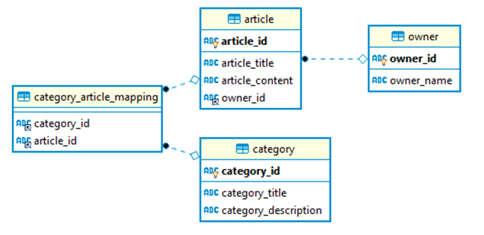

# DB0001. E-Magazine Report Generation
You are currently working on a project to manage an e-Magazine, which publishes articles for readers by a **sqlite relational database**.
The following is the schema of the table.

For reporting purpose, user asked you to write a query to rank the category diversity of each owner.
Specifically, the result should contain **owner ID**, **owner name** and **number of different categories of the articles the owner owns**,
which is **sorting from most different categories to the least**.

## Output Columns
1. owner_id
2. owner_name
3. different_category_count